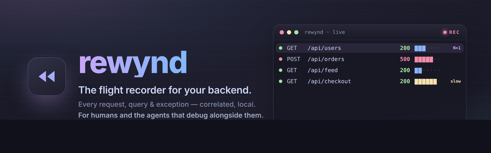

<p align="center">
  
</p>

<p align="center">
  <a href="https://github.com/SrinjoyDev/rewynd/actions/workflows/ci.yml"></a>
  <a href="./LICENSE"></a>
  
  
  
</p>

**A zero-config, OTLP-native flight recorder for your backend.** It silently records every
request — and background job — your backend handles, with the database queries, outbound calls,
logs, and exceptions each one caused, **correlated per request**, during local development. You
— or your coding agent — see exactly what happened. No `console.log`, no re-running.

<p align="center">
  
</p>

<p align="center"><sub>Above: the human view — click the broken request, see its whole story. Below: the same recording, driven by your coding agent.</sub></p>

<p align="center">
  
</p>

> Laravel Telescope, reborn for the terminal and language-agnostic — the first backend recorder
> your coding agent can actually drive. Works with any OpenTelemetry stack (Node, Python, Go,
> Ruby, Java, …); OpenTelemetry under the hood, zero config on top. Runs entirely on your machine.

> **v0.2.1 is live.** The core, the **TUI**, the CLI, the agent loop, the **MCP server**,
> capture across **Node / Python / Go / Ruby / any OpenTelemetry language**, distributed
> traces, background jobs, and the load view all work today — install below. Stars and
> feedback welcome.

---

## Install

```bash
# npm (the CLI + the Node capture shim) — the command it installs is `rewynd`:
npm i -D @rewynd/cli

# …Python (the capture shim + `rewynd-run`):
pip install rewynd

# …or grab the binary directly (macOS / Linux):
curl -fsSL https://raw.githubusercontent.com/SrinjoyDev/rewynd/main/scripts/install.sh | sh

# …or with Go:
go install github.com/SrinjoyDev/rewynd/core/cmd/rewynd@latest
```

Windows binaries are on the [releases page](https://github.com/SrinjoyDev/rewynd/releases),
or build from source — see [CONTRIBUTING](./CONTRIBUTING.md).

> The npm package is **`@rewynd/cli`** (npm reserves the bare `rewynd` name); the installed
> command is still `rewynd`. Python is `pip install rewynd` then `rewynd-run <your command>`.

## The problem

Frontend devs have the Chrome DevTools network tab. Backend devs have `print`. When an
endpoint is slow or broken, you sprinkle `console.log`, re-run the request five times, and
squint at which SQL fired. And coding agents have it worse — they write backend code and fly
blind, unable to see what it actually did.

rewynd is the network tab for your backend — for humans **and** agents.

## Quick start

```bash
# In your Node project (Express, Fastify, …), after installing (see Install above):
# run your normal dev command through rewynd — it auto-starts the recorder:
rewynd run npm run dev

# In another terminal:
rewynd tui                     # the live dashboard — watch requests stream in, click the broken one
rewynd ls                      # or list them; `rewynd show <id>` for one request's full story
```

```text
$ rewynd show 6928a80f
GET /api/users  ->  200  (15ms)

DETECTIONS
  ! n_plus_one — N+1 query — 10 identical statements

QUERIES (11)
      2ms  SELECT id, name FROM users ORDER BY id
      1ms  SELECT id, title FROM posts WHERE user_id = $1
      …  ×10  (the N+1, obvious at a glance)

LOGS (2)
  [info] listing users
  [info] assembled users with posts
```

## For your coding agent — the differentiator

rewynd gives agents a tight, structured **`clear → trigger → watch → read → fix`** loop so they
can debug a backend autonomously:

```bash
rewynd clear                                   # clean slate
curl localhost:3000/api/orders                 # the agent triggers the endpoint
rewynd watch --status 5xx --timeout 10s --json # blocks until it lands, prints the full trace
rewynd diagnose <id>                           # "what's wrong here" in one line
```

`watch` returns the failing SQL with its params, the exception and stack, and any detected
N+1 — as JSON the agent reads directly.

Or skip the CLI: rewynd ships an **MCP server** so agents introspect the backend natively.
Drop this into your Claude Code / Cursor MCP config:

```json
{
  "mcpServers": {
    "rewynd": { "command": "rewynd", "args": ["mcp"] }
  }
}
```

Tools: `get_stats`, `get_load_stats`, `list_requests`, `get_request`, `wait_for_request`,
`diagnose`, `get_last_error`, `clear`. The server also sends the whole debugging protocol as
MCP instructions on connect, so the agent knows *when* and *how* to use them.

**Ready-made integrations** for Claude Code (skill + MCP), Cursor (rules + MCP), Windsurf,
OpenCode, Codex, Cline, and Devin live in [`integrations/`](./integrations/) — drop the right
file into your project and any agent learns the `clear → trigger → watch → read → fix` loop.

## What it captures, correlated per flow

| | |
|---|---|
| **HTTP requests** | method, path, status, timing |
| **Background jobs** | queue consumers, workers, cron — recorded as first-class flows, ok/fail ([example](./examples/jobs/)) |
| **DB queries** | SQL + params + duration, with **N+1 detection** |
| **Outbound calls** | method, URL, status, duration |
| **Logs** | `console` / `pino` / `winston`, stamped with the flow's trace |
| **Exceptions** | type, message, stack |

## Commands

| Command | What it does |
|---|---|
| `rewynd run <cmd>` | Run your dev command with recording on (auto-starts the core) |
| `rewynd ls` | List requests (`--status 5xx`, `--slow`, `--has-error`, `--path`, `--json`) |
| `rewynd show <id>` | Full correlated trace for one request (`--json`) |
| `rewynd stats` | Load summary: throughput, latency p50/p95/p99, error rate, by endpoint. `--save <name>` then `--baseline <name>` to see if a fix helped (`--json`) |
| `rewynd watch` | Block until a matching request is recorded, then print it (`--json`) |
| `rewynd tail` | Stream requests as they arrive |
| `rewynd diagnose <id>` | Summarize what's wrong (N+1, exceptions, slow queries) |
| `rewynd last-error` | The most recent 5xx, in full |
| `rewynd clear` | Wipe the buffer |
| `rewynd status` | Is the core running, how many requests buffered |

## Privacy — it's all local

No cloud, no account, no telemetry on you. The core binds `127.0.0.1` and never makes an
outbound connection. A hard **prod guard** refuses to start under `NODE_ENV=production`.
Secrets are redacted; bodies are size-capped. Your request data never leaves your machine.

## How it works

```
your app ─(stock OpenTelemetry, configured by the shim)→ OTLP ─→ rewynd core ─→ SQLite
                                            (HTTP :4318 · gRPC :4317)  │
                                              TUI · CLI · MCP read the same recording
```

The shim stands on OpenTelemetry's auto-instrumentation (you never see OTel config). The Go
core is a single static binary: OTLP receiver (HTTP **and** gRPC) → correlation → detections →
embedded SQLite, with the TUI, CLI, and MCP as thin clients over it. Any OTel-emitting
service connects — gRPC is what most SDKs default to.

**It scales with your project.** Because correlation keys on the OpenTelemetry trace, this is
not a single-app toy: run a whole polyglot stack locally — several Node and Python services, a
worker, a gateway — all pointed at the one core. A request that fans out across services is
**stitched back into one trace**: the entry service is the root, and every query, outbound
call, and log is tagged with the service it ran in, so you see the whole distributed flow in
one view ([runnable example](./examples/distributed/)). The store is a WAL'd ring buffer that
keeps the most recent requests (1000 by default); set `REWYND_MAX_REQUESTS` higher for a long
session or a busy app that wants to leave nothing behind.

## Supported stacks

**Node.js** — Express, Fastify, NestJS (anything on Node's `http`); `pg`, `mysql2`, Drizzle,
Sequelize, Knex; `fetch` / axios; `console`, `pino`, `winston`. One command:
`rewynd run <your dev command>`.

**Python** — FastAPI, Flask, Django; `psycopg2`, SQLAlchemy; `requests`, `httpx`; stdlib
`logging`. One command: `pip install rewynd && rewynd-run <your command>`.

**Go** — `go get github.com/SrinjoyDev/rewynd/sdk/go`, then `rewynd.Start(ctx)` at boot and
standard OpenTelemetry instrumentation (`otelhttp`, `otelsql`). Go has no runtime
auto-instrumentation, so it's minimal setup rather than zero — but it feeds the same core. See
[`sdk/go`](./sdk/go/) and [`examples/go-service`](./examples/go-service/).

**Any other language** — Java, .NET, Ruby, PHP, Rust, … — works through its standard
OpenTelemetry auto-instrumentation. `rewynd run -- <your command>` sets the OTLP environment
variables, so e.g. `rewynd run -- java -javaagent:opentelemetry-javaagent.jar -jar app.jar`
records a JVM app with no code change. See **[docs/languages.md](./docs/languages.md)**.

They all feed the **same** core over OTLP, so the TUI, CLI, and MCP work identically across
languages — one local recorder for every backend, human or agent.

## Roadmap

- [x] Zero-config capture + per-request correlation (Node, ESM/`tsx`)
- [x] Go core: OTLP receiver, SQLite store, N+1 detection
- [x] CLI + the agent `watch` loop, `rewynd run` launcher
- [x] MCP server (`rewynd mcp`) + `mcp.json` quickstart
- [x] The live TUI (request list + waterfall)
- [x] N+1, slow-query, and slow-request detection
- [x] Header capture + redaction; outbound HTTP
- [x] **Python** shim (FastAPI/Flask/Django) over the same core — the multi-language unlock
- [x] Request/response body capture (redacted, size-capped)
- [x] **v0.2.1** released: cross-platform binaries + `curl | sh` installer + `go install`
- [x] **Agent-native**: MCP instructions + `get_stats`; drop-in [integrations](./integrations/) for Claude Code, Cursor, Windsurf, OpenCode, Codex, Cline, Devin
- [x] TUI control panel: live search, slow filter, scrollable enriched detail
- [x] **OTLP/gRPC** intake (:4317) alongside HTTP — most SDKs default to gRPC
- [x] **Distributed traces**: multi-service stitching with per-service attribution
- [x] **Background jobs / queue consumers** recorded as first-class flows (not just HTTP)
- [x] **Load view**: `rewynd stats` + `get_load_stats` + TUI `S` panel (throughput, p50/p95/p99, error rate, by endpoint)
- [x] **Go SDK** (`sdk/go`) — `rewynd.Start(ctx)` + standard OTel instrumentation
- [x] **Any OTel language** via `rewynd run` (Java/.NET/Ruby/PHP); **regression diff** (`stats --save`/`--baseline`)
- [x] **npm** (`@rewynd/cli`) and **PyPI** (`rewynd`) published — install paths all live
- [ ] Zero-config shims that bundle the OTel agent for more languages (Ruby gem, Java helper)

## Contributing

See [CONTRIBUTING.md](./CONTRIBUTING.md). The repo is a pnpm + Go monorepo: `core/` (the Go
core + CLI/TUI/MCP), `packages/` (the Node shim + npm wrapper + Python shim), `sdk/go/` (the Go
SDK), and `examples/` (express-postgres, distributed, jobs, go-service, ruby-service).

## License

[MIT](./LICENSE)
